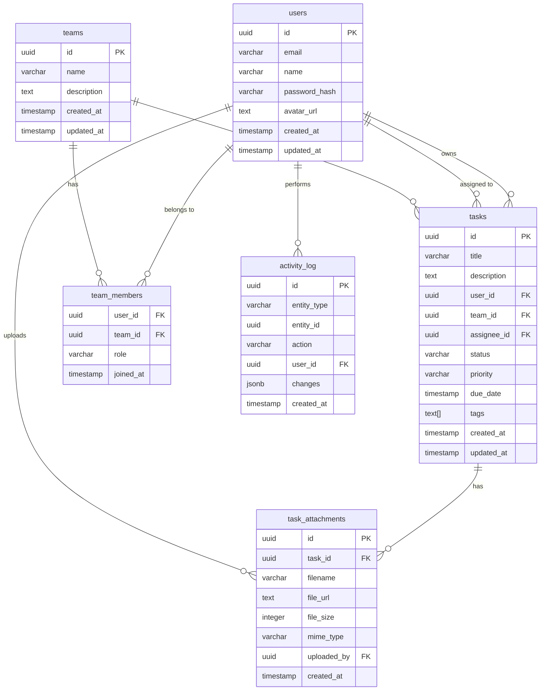

# ExampleApp - Database Schema

## Connection Details

| Property | Value |
|----------|-------|
| Host | db.example.com |
| Port | 5432 |
| Database | example_production |
| Max Connections | 100 |

## Entity Relationship Diagram



## Tables

### users

Stores user account information.

| Column | Type | Constraints | Description |
|--------|------|-------------|-------------|
| id | UUID | PRIMARY KEY | Unique identifier |
| email | VARCHAR(255) | UNIQUE, NOT NULL | User email address |
| name | VARCHAR(255) | NOT NULL | Display name |
| password_hash | VARCHAR(255) | NOT NULL | Bcrypt hashed password |
| avatar_url | TEXT | NULLABLE | Profile picture URL |
| created_at | TIMESTAMP | NOT NULL, DEFAULT NOW() | Account creation time |
| updated_at | TIMESTAMP | NOT NULL, DEFAULT NOW() | Last update time |

**Indexes:**
- `idx_users_email` on `email`

### tasks

Stores task information. Core table for Task creation and management.

| Column | Type | Constraints | Description |
|--------|------|-------------|-------------|
| id | UUID | PRIMARY KEY | Unique identifier |
| title | VARCHAR(255) | NOT NULL | Task title |
| description | TEXT | NULLABLE | Task description |
| user_id | UUID | FOREIGN KEY (users.id) | Task owner |
| team_id | UUID | FOREIGN KEY (teams.id), NULLABLE | Associated team |
| assignee_id | UUID | FOREIGN KEY (users.id), NULLABLE | Assigned user |
| status | VARCHAR(20) | NOT NULL, DEFAULT 'pending' | pending, in_progress, completed |
| priority | VARCHAR(20) | NOT NULL, DEFAULT 'medium' | low, medium, high, urgent |
| due_date | TIMESTAMP | NULLABLE | Task deadline |
| tags | TEXT[] | NULLABLE | Array of tags for Tags and categories |
| created_at | TIMESTAMP | NOT NULL, DEFAULT NOW() | Creation time |
| updated_at | TIMESTAMP | NOT NULL, DEFAULT NOW() | Last update time |

**Indexes:**
- `idx_tasks_user_id` on `user_id`
- `idx_tasks_team_id` on `team_id`
- `idx_tasks_status` on `status`
- `idx_tasks_due_date` on `due_date`
- `idx_tasks_tags` GIN index on `tags`

### teams

Stores team information for Team collaboration.

| Column | Type | Constraints | Description |
|--------|------|-------------|-------------|
| id | UUID | PRIMARY KEY | Unique identifier |
| name | VARCHAR(255) | NOT NULL | Team name |
| description | TEXT | NULLABLE | Team description |
| created_at | TIMESTAMP | NOT NULL, DEFAULT NOW() | Creation time |
| updated_at | TIMESTAMP | NOT NULL, DEFAULT NOW() | Last update time |

### team_members

Junction table for users and teams relationship.

| Column | Type | Constraints | Description |
|--------|------|-------------|-------------|
| user_id | UUID | FOREIGN KEY (users.id) | User reference |
| team_id | UUID | FOREIGN KEY (teams.id) | Team reference |
| role | VARCHAR(20) | NOT NULL, DEFAULT 'member' | owner, admin, member |
| joined_at | TIMESTAMP | NOT NULL, DEFAULT NOW() | Join time |

**Primary Key:** (user_id, team_id)

### task_attachments

Stores file attachment metadata for File attachments.

| Column | Type | Constraints | Description |
|--------|------|-------------|-------------|
| id | UUID | PRIMARY KEY | Unique identifier |
| task_id | UUID | FOREIGN KEY (tasks.id) | Associated task |
| filename | VARCHAR(255) | NOT NULL | Original filename |
| file_url | TEXT | NOT NULL | Storage URL |
| file_size | INTEGER | NOT NULL | Size in bytes |
| mime_type | VARCHAR(100) | NOT NULL | File MIME type |
| uploaded_by | UUID | FOREIGN KEY (users.id) | Uploader |
| created_at | TIMESTAMP | NOT NULL, DEFAULT NOW() | Upload time |

### activity_log

Stores activity history for Activity history.

| Column | Type | Constraints | Description |
|--------|------|-------------|-------------|
| id | UUID | PRIMARY KEY | Unique identifier |
| entity_type | VARCHAR(50) | NOT NULL | 'task', 'team', 'user' |
| entity_id | UUID | NOT NULL | Reference to entity |
| action | VARCHAR(50) | NOT NULL | 'created', 'updated', 'deleted' |
| user_id | UUID | FOREIGN KEY (users.id) | Actor |
| changes | JSONB | NULLABLE | Changed fields |
| created_at | TIMESTAMP | NOT NULL, DEFAULT NOW() | Event time |

**Indexes:**
- `idx_activity_log_entity` on `(entity_type, entity_id)`
- `idx_activity_log_user_id` on `user_id`
- `idx_activity_log_created_at` on `created_at`

## Migrations

All database migrations are managed using the migration tool. Run migrations with:

```bash
npm run db:migrate
```

## Backup

Database backups are performed daily and stored for 30 days.

**Backup schedule:**
- Full backup: Daily at 02:00 UTC
- Incremental: Every 6 hours

## Contact

For database questions, contact Sarah Johnson (sarah@example.com).
